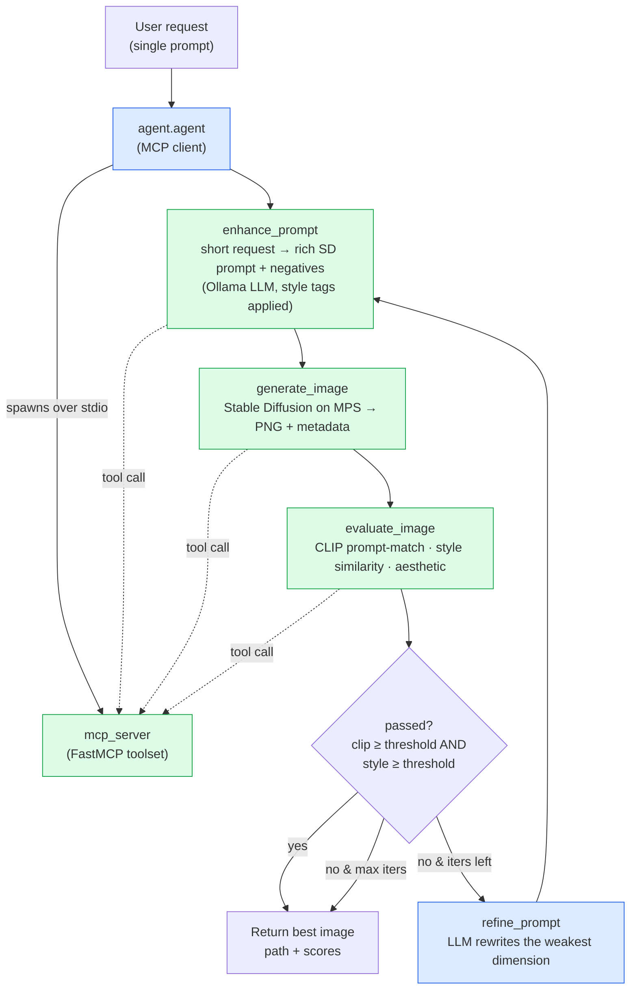

# Semi-3D-Anime Image Generation Agent (MCP + Harness)

An AI agent that turns a short text request into a polished image in **semi-3D anime**
style (glossy, Pixar-meets-anime mobile-game character renders — see `images/`). The
image-generation toolset is exposed as a reusable **MCP server**; an **agent harness**
drives it with a system prompt, an auto-refine loop, evals, and context compaction.

Built for the local constraint: **MacBook M1 Pro, 32GB**, using Stable Diffusion via
`diffusers` on the **MPS (Metal)** backend and a local LLM via **Ollama**.

## Architecture

```
config.yaml            Central config (models, device, eval thresholds, loop iters)
mcp_server/            Reusable MCP server + image toolset
  server.py            FastMCP server (stdio) exposing the tools below
  sd_pipeline.py       diffusers wrapper — DreamShaper-8 (SD1.5) on MPS, fp16
  evals.py             CLIP prompt-alignment, style-similarity, aesthetic, vision judge
  styles.py            "semi-3d-anime" style preset (positive tags + negatives)
  llm_prompt.py        LLM-backed enhance_prompt (Ollama, graceful fallback)
agent/                 Agent harness (MCP client)
  agent.py             generate -> evaluate -> refine loop
  llm.py               Ollama chat + prompt-refinement
  context.py           context-compaction logic
  system_prompt.txt    orchestrator role + style rubric
evals/run_evals.py     batch eval harness (regression check)
outputs/               generated PNGs + sidecar metadata JSON
```

### MCP tools
| Tool | Purpose |
|------|---------|
| `enhance_prompt(user_request, style)` | LLM expands a short request into a rich SD prompt + negatives |
| `generate_image(prompt, ...)` | Render with Stable Diffusion (MPS), save PNG + metadata |
| `evaluate_image(image_path, prompt)` | CLIP score, style similarity, aesthetic, pass/fail |
| `list_styles()` / `list_models()` | Introspection for any MCP client |
| `vision_judge(image_path, prompt)` | Optional multimodal Ollama qualitative grade |

## Setup

```bash
bash setup.sh
```

This creates a **Python 3.12** venv (`.venv`), installs `diffusers`/`accelerate`/`torch`/
`open_clip`/`mcp`/`ollama`, downloads **DreamShaper-8** (~2GB), and checks Ollama.

> Why 3.12: the system default here is Python 3.14, which has no PyTorch wheels yet.

Pull a local LLM if you don't have one (any of these work; set it in `config.yaml`):
```bash
ollama pull qwen3.5:4b      # lightweight default
```

## Generate an image from a single prompt

The agent takes **one short text request** and produces a finished semi-3D anime image —
no other arguments needed. Just describe the subject; the agent handles prompt engineering,
style, generation, scoring and refinement.

```bash
./.venv/bin/python -m agent.agent "a cheerful girl with pink hair waving"
```

Anything after the module name is treated as the prompt (quote it so the shell keeps it as
one argument). With no argument, it falls back to a built-in demo prompt.

```bash
./.venv/bin/python -m agent.agent "two friends playing video games on a couch"
./.venv/bin/python -m agent.agent          # uses the default demo prompt
```

You'll see the loop run live: connect to MCP server → enhance prompt → generate → evaluate →
(refine if below threshold) → final **best** image path + scores. The chosen PNG (plus a
sidecar `.json` of its generation metadata) lands in `outputs/`. Files are named
descriptively from the prompt, e.g. `american-teenagers-laughing-dancing-party_20260623_115044.png`.

### How the agent works



**In words:**

1. **Enhance** — the LLM (`enhance_prompt` tool) expands your one-line request into a vivid,
   comma-separated SD prompt; the `semi-3d-anime` style preset appends its tags and a default
   negative prompt.
2. **Generate** — `generate_image` renders the prompt with Stable Diffusion on MPS and writes
   a PNG + metadata to `outputs/`.
3. **Evaluate** — `evaluate_image` scores the result: CLIP alignment to your *original*
   request, style similarity to the reference samples in `images/`, and an aesthetic proxy.
4. **Decide** — if both the CLIP and style thresholds pass, stop and return. Otherwise, if
   iterations remain, the LLM (`refine_prompt`) rewrites the weakest dimension and the loop
   repeats; the highest-`composite`-scoring image is always kept as the best result.

Steps run as MCP tool calls against the bundled server; context across the loop is kept
bounded by `agent.context.ContextManager`. The loop runs at most `loop.max_iters` times
(see `config.yaml`).

### Use the MCP server standalone (e.g. from Claude Desktop)
```bash
./.venv/bin/python -m mcp_server.server   # stdio MCP server
```
Example `claude_desktop_config.json` entry:
```json
{
  "mcpServers": {
    "semi3d-image-gen": {
      "command": "/absolute/path/to/LimitBreak/.venv/bin/python",
      "args": ["-m", "mcp_server.server"],
      "cwd": "/absolute/path/to/LimitBreak"
    }
  }
}
```

### Batch evals
```bash
./.venv/bin/python evals/run_evals.py --steps 20
```

## Tuning (`config.yaml`)
- `image.default_model`: `dreamshaper-8` (fast) or `dreamshaper-xl` (1024px, slower).
- `image.steps` / `width` / `height`: lower for faster demos.
- `evals.clip_threshold` / `style_threshold`: the loop's acceptance bar.
- `loop.max_iters`: how many refine attempts.
- `llm.model`: the Ollama model used for enhance/refine.

## Notes on model choice
The samples are glossy semi-3D anime character renders. **DreamShaper-8 (SD1.5)** is the
best style/speed match on an M1 and is HuggingFace-hosted (loads directly via `diffusers`,
no manual CivitAI download). DreamShaper-XL is available for higher fidelity at ~2-4x the
time. Image generation deliberately uses `diffusers` (not GGUF/Ollama) — Ollama runs the
*LLM* only; it cannot run Stable Diffusion.
